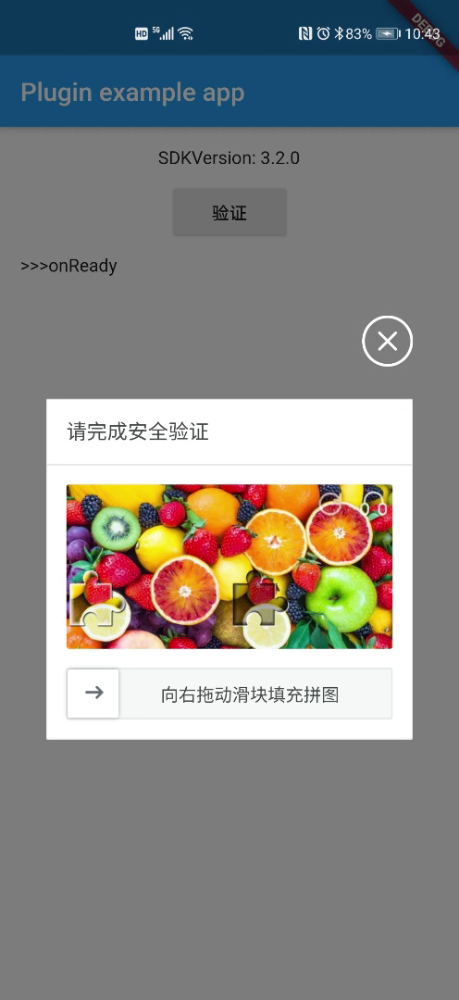
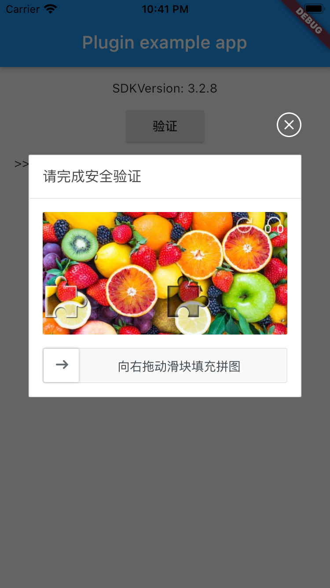

# flutter_yidun_captcha

适用于 Flutter 的网易易盾行为式验证码插件

[![pub version][pub-image]][pub-url]

[pub-image]: https://img.shields.io/pub/v/flutter_yidun_captcha.svg
[pub-url]: https://pub.dev/packages/flutter_yidun_captcha

<!-- START doctoc generated TOC please keep comment here to allow auto update -->
<!-- DON'T EDIT THIS SECTION, INSTEAD RE-RUN doctoc TO UPDATE -->

- [屏幕截图](#%E5%B1%8F%E5%B9%95%E6%88%AA%E5%9B%BE)
- [快速开始](#%E5%BF%AB%E9%80%9F%E5%BC%80%E5%A7%8B)
  - [安装](#%E5%AE%89%E8%A3%85)
  - [用法](#%E7%94%A8%E6%B3%95)
    - [获取 SDK 版本](#%E8%8E%B7%E5%8F%96-sdk-%E7%89%88%E6%9C%AC)
    - [开始验证](#%E5%BC%80%E5%A7%8B%E9%AA%8C%E8%AF%81)
- [相关链接](#%E7%9B%B8%E5%85%B3%E9%93%BE%E6%8E%A5)
- [许可证](#%E8%AE%B8%E5%8F%AF%E8%AF%81)

<!-- END doctoc generated TOC please keep comment here to allow auto update -->

## 屏幕截图

<div>
  
  
</div>

## 快速开始

### 安装

将此添加到包的 pubspec.yaml 文件中：

```yaml
dependencies:
  flutter_yidun_captcha: ^0.0.1
```

您可以从命令行安装软件包：

```bash
$ flutter packages get
```

请在 `android/build.gradle` 添加以下代码：

```diff
allprojects {
    repositories {
        google()
        jcenter()
+        flatDir {
+            dirs project(':flutter_yidun_captcha').file('libs')
+        }
    }
}
```

### 用法

#### 获取 SDK 版本

```dart
String sdkVersion = await YidunCaptcha.sdkVersion;
```

#### 开始验证

```dart
YidunCaptchaConfig config = YidunCaptchaConfig(
  captchaId: '<captchaId>',
  // mode: 'MODE_INTELLIGENT_NO_SENSE',
  timeout: 6000,
  languageType: 'LANG_ZH_CN',
);
await YidunCaptcha.verify(
  config: config,
  onReady: () {
    _addLog('onReady', null);
  },
  onValidate: (dynamic data) {
    _addLog('onValidate', data);
  },
  onClose: (dynamic data) {
    _addLog('onClose', data);
  },
  onError: (dynamic data) {
    _addLog('onError', data);
  },
);
```

## 相关链接

- https://support.dun.163.com/documents/15588062143475712?docId=150442945983729664
- https://support.dun.163.com/documents/15588062143475712?docId=150442931089756160

## 许可证

```
MIT License

Copyright (c) 2020 LiJianying <lijy91@foxmail.com>

Permission is hereby granted, free of charge, to any person obtaining a copy
of this software and associated documentation files (the "Software"), to deal
in the Software without restriction, including without limitation the rights
to use, copy, modify, merge, publish, distribute, sublicense, and/or sell
copies of the Software, and to permit persons to whom the Software is
furnished to do so, subject to the following conditions:

The above copyright notice and this permission notice shall be included in all
copies or substantial portions of the Software.

THE SOFTWARE IS PROVIDED "AS IS", WITHOUT WARRANTY OF ANY KIND, EXPRESS OR
IMPLIED, INCLUDING BUT NOT LIMITED TO THE WARRANTIES OF MERCHANTABILITY,
FITNESS FOR A PARTICULAR PURPOSE AND NONINFRINGEMENT. IN NO EVENT SHALL THE
AUTHORS OR COPYRIGHT HOLDERS BE LIABLE FOR ANY CLAIM, DAMAGES OR OTHER
LIABILITY, WHETHER IN AN ACTION OF CONTRACT, TORT OR OTHERWISE, ARISING FROM,
OUT OF OR IN CONNECTION WITH THE SOFTWARE OR THE USE OR OTHER DEALINGS IN THE
SOFTWARE.
```
